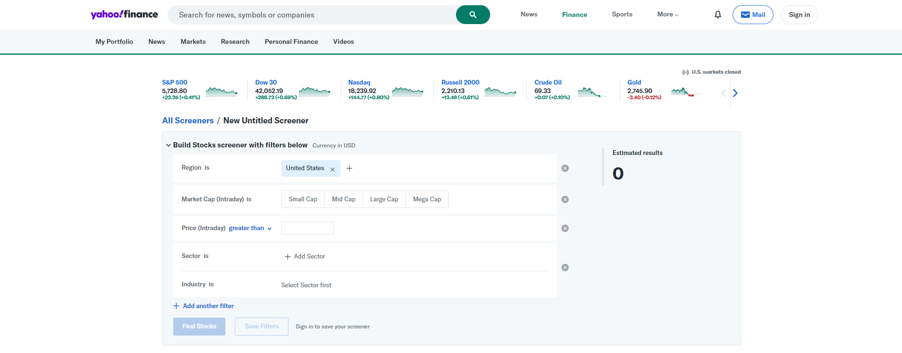
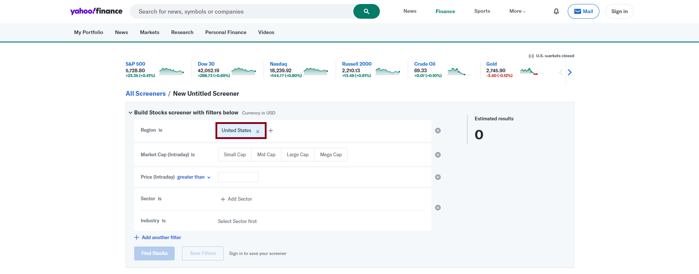
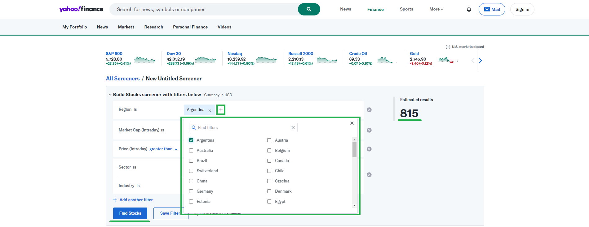

# Extração de dados de páginas html com Python e Selenium

## Contexto
Qualquer página na internet podesse ser "varrida" e seus dados capturados, a idéia desse **laboratório** é demonstrar o uso e facilidade da biblioteca Selenium para realizar essa tarefa. A página alvo é do Finance Yahoo onde tem um formulário simples e muitos dados.

## Objetivo
Extrair os dados da tabela (html) após realizar uma pesquisa. _Obs: Todos os dados, isso inclui navegar pela paginação._

## Planejamento passo a passo
É necessário entender como funciona a página e fazer um passo a passo com todas as ações necessárias para alcançar o objetivo.

1. Reconhecimento do formulário.


2. Limpando o filtro.


3. Aplicando novo filtro.

Observe a dinâmica da página, a quantidade de registros é carregada, nesse caso 815 e o botão de busca é habilitado.
Por conta disso pode ser gerado um delay...

4. Gerando uma consulta.

Note que ao clicar no botão "Find Stocks" uma barra de progresso é exibida indicando o processamento da consulta e um possivel delay.

5. Análise da estrutura da tabela de resultados.
- Cabeçalho

Dentre as informações carregadas, é importante destacar o cabeçalho, lista de colunas que representa cada campo a ser extraido.

- Paginação

Dentre as informações carregadas, é importante destacar o hyperlink "Next" que leva a página seguinte da pesquisa.

6. Navegando até terminar a paginação

Quando a paginação acaba o hiperlink é desativado.

## Considerações e obstáculos
Nem tudo da certo, e aqui não seria diferente. Existe várias condições que podem levar a erro:
- Delay e demora a carregar elementos/página: A lib Selenium tem gatilho para TIMEOUT, indicado para esperar por um tempo o carregamento de algum componente.
- Delay e demora a carregar elementos/página: Algumas ações implicam em uma request e processamento isso pode demorar.
- Crash: Em qualquer momento da interação é possivel correr erro na página levando a um colapso, não há nada a fazer, tente de novo.
- Mudança de layout: Ao varrer uma página você está confinado ao html daquele momento, é bem possivel que com passar do tempo o html mude e a referência relativa/absoluta ao elemento mude e não seja mais possível carregar o elemento. Ou seja, atualização do script com novo caminho para o elemento.
- Documentação zero: Ao contrário de APIs onde tem uma documentação com entrada e saída de dados bem definidadas, navegar por html é zero garantias, por isso esteja ciente que vai haver mudanças e não tem documentação de apóio.
- Execução em diferentes ambientes podem gerar erros e delays.
- Execução no win com antivirus podem bloquear algumas chamadas no caregamento da página.
- Dependência de um navegador específico e atualizações dele pode quebrar o script.
- Uso constante da lib Selenium pode gerar muitos arquivos temporários, uma rotina de limpeza deve ser desenvolvida.
- Não é performático e preciso comparado o consumo de uma API.

## Modelo flexível
Esse modelo está definido em 3 camadas:
- Extração de dados via Selenium
    - A estratégia adotada foi usar comandos que encadeados compõem o passo a passo.
    - Nesse caso foi usado o método "process" seguindo o passo a passo, mas poderia ter vários caminhos diferentes com objetivo de extrair diversos dados.
- Tratamento dos dados extraídos
    - Uma vez extraído os dados, esses são enviados para uma camada de tratamento, possibilitando executar higienização, normalização ou qualquer tratamento adequado ao negócio.
- Exportação de dados no formato CSV
    - Por fim os dados prontos são enviados para uma camada final que expõem os dados em um arquivo CSV.
    - Essa camada é importante pois permite que o artefato final possa ser gerenciado conforme a regra de negócio, por exemplo JSon, XML, TSV, etc.

## Ambiente de execução
Como não existe imagem docker associada a esse laboratório, recomendo que rode no Linux (WSL com UI). Embora no Windows também fuincione.

## Instalando dependência
Todas as depêndencias estão listadas no arquivo requirements.txt
- ```pip install -r requirements.txt```

## Execução
A partir da pasta raiz do projeto
- ```python main.py```

## Testes
A partir da raiz do projeto executar:
- ```python -m unittest discover```

Existe casos de testes a ser explorados...

## Debug
O método debug tem algumas informações estatística.
- ```[2024-11-01 21:45:08,098][INFO] Duração da execução: 151.776 segundo(s)```
- ```[2024-11-01 21:45:08,098][INFO] Data Header Qtd: 10.```
- ```[2024-11-01 21:45:08,098][INFO] Data Qtd: 815.```

## Log
Log é essencial para acompanhar os acontecimentos, por isso foi adotado de forma simples a ser expandido conforme a necessidade. Segue abaixo exemplos:
- ```[2024-11-01 21:42:31,318][INFO] MFY: Processo iniciado```
- ```[2024-11-01 21:45:08,098][INFO] MFY: Processo finalizado```
- ```[2024-11-01 21:45:08,098][INFO] Extractor: Gerando arquivo CSV vazio.```
- ```[2024-11-01 21:45:08,129][INFO] Extractor: Arquivo CSV gerado.```
- ```[2024-11-01 21:45:08,363][INFO] Arquivo CSV ./output/data/01112024_214508_result.csv preenchido com sucesso.```
- ```[2024-11-01 21:45:08,363][INFO] Hash MD5 504a14aa7c58b462728bc133f53024bc```

## PrintScreen
PrintScreen são gerados ao término da execução, em caso de sucesso ou falha.

## Comentários
Os comentários/documentaçao do código estão em português para ser mais simples de entender. Não, não é uma prática comum, mas isso é lab.

## Lista de melhorias
Não prometo continuidade mas são itens interessante de ter.
- [ ] Ambiente docker para padronizar ambiente de execução.
- [ ] Habilitar passagem de parâmetro via terminal para preenchimento do formulário.
- [ ] Habilitar passagem de parâmetro via terminal para definir os campos a serem carregados.
- [ ] Rotina de limpeza de arquivos temporários que não são mais usados, _/tmp_ e _ChromeDrive_ por exemplo.
- [ ] No caso de expansão, gerar uma interface para que a class Extractor não fique dependente de Table.
- [ ] Melhor controle de exceção principalmente com procura de elemento via Selenium.
